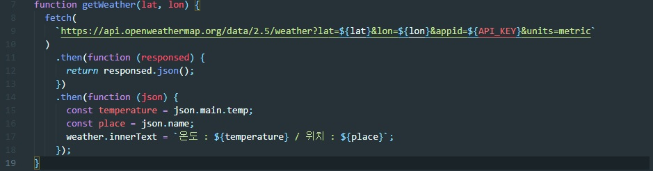

# To Do List Homepage
>크롬 기반 To Do List  
>https://juferis.github.io/todo-list-homepage/

 

## 사용기술
- HTML5
- CSS3 
- JS 
- [OpenWeather API](https://openweathermap.org/)

## 핵심기능
- 사용자의 이름 기억
- GPS를 이용한 위치 및 온도 표시
- To Do 내용을 저장 및 삭제 가능
- 현재 연도와 시간 표시
- 테마 변경 기능

## 핵심코드

OpenWeather API를 이용하여 위치 정보와 온도를 JSON으로 받아옵니다.
